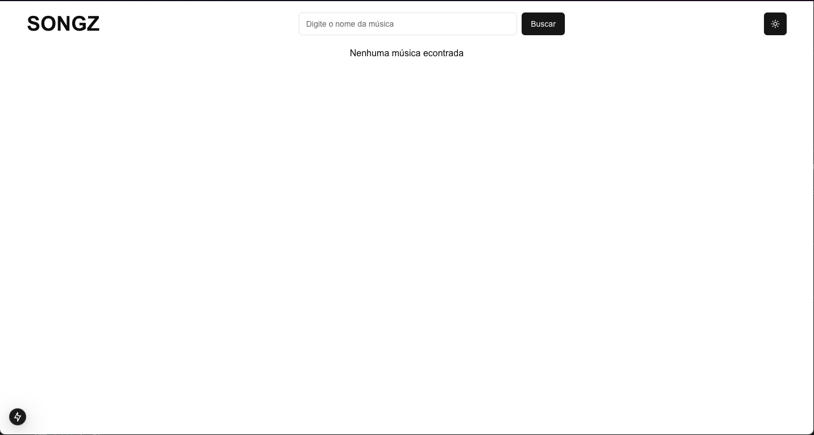
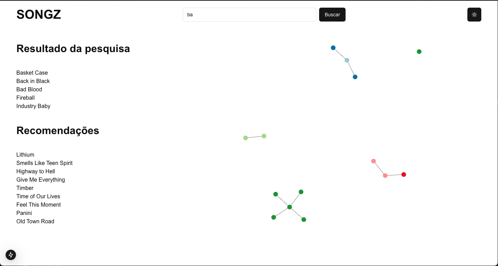
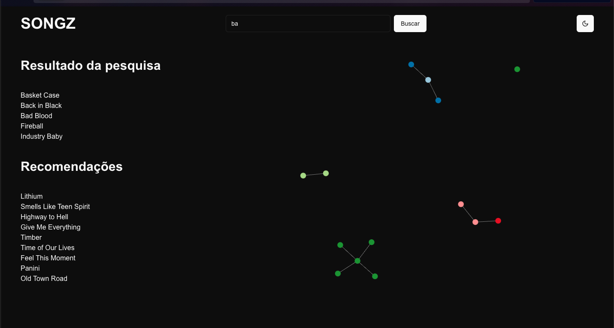

# Songz

**Número da Lista**: 1<br>
**Conteúdo da Disciplina**: Grafos 1<br>

## Alunos
| Matrícula | Aluno           |
| --------- | --------------- |
| 200054333 | [Arthur Gabriel Lima Gomes](https://github.com/ArthurGabrieel) |

## Sobre 
Songz é um projeto desenvolvido para a disciplina de Projeto de Algoritmos, com o objetivo de explorar conceitos de teoria dos grafos aplicados a um sistema de recomendação de músicas. Utilizamos grafos para representar relações entre músicas, como conexões baseadas em gêneros musicais e colaborações entre artistas.
O usuário pode buscar por músicas, e o sistema exibe as músicas relacionadas visualmente como um grafo interativo.

## Screenshots

### **Tela inicial**:


### **Busca por música**:


### **Tema escuro**:


## Instalação 
**Linguagem**: Javascript<br>
**Framework**: React<br>

É necessário ter o Node.js e npm instalado para rodar o projeto. Para instalar as dependências, execute o comando abaixo:

```npm install```

Para rodar o projeto, execute o comando abaixo:

```npm run dev```

O projeto estará disponível em `http://localhost:3000/`.


## Uso 

1. No campo de busca, insira o nome de uma música ou parte dele.
2. Clique no botão Buscar.
3. O grafo exibirá a música pesquisada e suas conexões com outras músicas relacionadas.
4. Você pode clicar nos nós para destacar conexões ou explorar o grafo utilizando zoom e arrastando os elementos.

## Outros

[Link de apresentação do projeto](https://youtu.be/p40grdFfmds)
